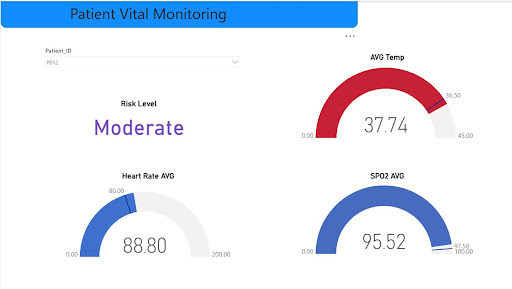

# 🏥 Patient Vitals Monitoring Data Pipeline on GCP

An **end-to-end, real-time data engineering pipeline** built on **Google Cloud Platform (GCP)** that simulates patient vital signs, streams them in real time, processes data through a **Medallion Architecture**, and visualizes the results on a **live Power BI dashboard**.

---

## 🧠 Overview

This project demonstrates a **serverless and event-driven architecture** for healthcare monitoring.  
It simulates live patient data (heart rate, temperature, SPO₂), cleans and aggregates it using **Apache Beam on Dataflow**, and visualizes the final results in **Power BI** via **BigQuery**.

---

## 🏗️ Architecture

The pipeline follows a **Medallion Architecture** pattern with three layers:

| Layer | Description | Destination |
|-------|--------------|--------------|
| 🟫 **Bronze Layer** | Stores raw, unprocessed JSON messages from Pub/Sub. | Cloud Storage (GCS) |
| ⚪ **Silver Layer** | Cleans, validates, and enriches data (adds `risk_score`, `risk_level`). | Cloud Storage (GCS) |
| 🟨 **Gold Layer** | Aggregates cleaned data into 1-minute windows for analytics. | BigQuery |

---

## 🧰 Tech Stack

| Component | Service / Tool |
|------------|----------------|
| ☁️ **Cloud Platform** | Google Cloud Platform (GCP) |
| 📥 **Data Ingestion** | Google Pub/Sub |
| ⚙️ **Stream Processing** | Google Dataflow |
| 🧩 **Framework** | Apache Beam (Python SDK) |
| 🪣 **Data Lake** | Google Cloud Storage (GCS) |
| 🧮 **Data Warehouse** | Google BigQuery |
| 📊 **Visualization** | Power BI (DirectQuery mode) |
| 🧬 **Data Source** | Python simulator (`patient_vitals_simulator.py`) |

---

## 📂 Project Structure

```
patient-vitals-pipeline/
│
├── patient_vitals_simulator.py          # Publishes simulated vitals data to Pub/Sub
├── streaming_medallion_pipeline.py      # Apache Beam pipeline (Dataflow)
│
├── .env                                # Environment variables for each script
├── requirements.txt                    # Python dependencies
│
└── README.md                           # Project documentation
```

---

## 💾 Components Explanation

### 🩺 1. `patient_vitals_simulator.py` — *Publisher*

- Generates real-time patient data for **20 unique patient IDs**.  
- Simulates:
  - `heart_rate`, `spo2`, `temperature`
- Injects **10% faulty data** intentionally (missing, negative, out-of-range).  
- Publishes JSON messages to **Pub/Sub** topic (`patient_vitals_stream`).

**Example JSON Message:**
```json
{
  "patient_id": "P014",
  "timestamp": "2025-11-07T14:00:15Z",
  "heart_rate": 85.1,
  "spo2": 97.4,
  "temperature": 98.7
}
```

---

### 🔄 2. `streaming_medallion_pipeline.py` — *Subscriber (Apache Beam on Dataflow)*

- Subscribes to the **Pub/Sub topic**.
- Processes data using **Medallion Architecture**:

| Stage | Task | Output |
|--------|------|---------|
| **Bronze** | Store raw JSON data for audit | `gs://<bucket>/bronze/` |
| **Silver** | Validate, clean, and enrich data | `gs://<bucket>/silver/` |
| **Gold** | Aggregate (1-minute window), calculate averages and max risk | `BigQuery` |

**Gold Layer Schema (BigQuery):**
| Column | Type | Description |
|---------|------|-------------|
| patient_id | STRING | Unique patient ID |
| window_start | TIMESTAMP | Start of the 1-min aggregation window |
| avg_heart_rate | FLOAT | Average heart rate |
| avg_spo2 | FLOAT | Average oxygen saturation |
| avg_temp | FLOAT | Average temperature |
| max_risk_level | STRING | Highest risk level during the window |

---

## ⚙️ Setup & Execution

### 🧩 Prerequisites

✅ Enable the following APIs in your GCP Project:
- Pub/Sub  
- Dataflow  
- Cloud Storage  
- BigQuery  

✅ Create Resources:
- **Pub/Sub topic:** `patient_vitals_stream`
- **Pub/Sub subscription:** `patient_vitals_subscription`
- **GCS bucket:** `gs://patient-vitals-streaming-bucket/`
  - Folders: `/bronze/`, `/silver/`, `/temp/`, `/staging/`
- **BigQuery dataset:** `healthcare`
  - Table: `patient_risk_analytics` (schema as above)

✅ Install dependencies:
```bash
pip install google-cloud-pubsub google-cloud-bigquery apache-beam[gcp] python-dotenv
```

---

### 🔧 1. Configure Environment Variables

#### For `patient_vitals_simulator.py`
```bash
GCP_PROJECT=your-project-id
PUBSUB_TOPIC=patient_vitals_stream
PATIENT_COUNT=20
STREAM_INTERVAL=2
ERROR_RATE=0.1
```

#### For `streaming_medallion_pipeline.py`
```bash
GCP_PROJECT=your-project-id
PUBSUB_SUBSCRIPTION=projects/your-project-id/subscriptions/patient_vitals_subscription
BRONZE_PATH=gs://your-bucket-name/bronze/
SILVER_PATH=gs://your-bucket-name/silver/
BIGQUERY_TABLE=your-project-id:healthcare.patient_risk_analytics
TEMP_LOCATION=gs://your-bucket-name/temp/
STAGING_LOCATION=gs://your-bucket-name/staging/
REGION=us-central1
```

---

### 🚀 2. Run the Pipeline

#### Step 1: Deploy the Dataflow Job (Subscriber)
```bash
python3 streaming_medallion_pipeline.py     --runner DataflowRunner     --region us-central1
```

#### Step 2: Start the Simulator (Publisher)
```bash
python3 patient_vitals_simulator.py
```

✅ Output:
```
Starting patient vitals simulator with error injection... Press Ctrl+C to stop.
Published: {"patient_id": "P014", "timestamp": "...", "heart_rate": 85.1, ...}
Published: {"patient_id": "P005", "timestamp": "...", "heart_rate": -1, ...}
...
```

---

## 📊 Dashboard Design & Insights

Below is the **Power BI dashboard** connected live to **BigQuery** via **DirectQuery** mode.  
It provides real-time monitoring of patient vitals and their risk status.



### 🧾 Dashboard Components

| Component | Description |
|------------|--------------|
| **Patient ID Dropdown** | Allows selection of individual patients to view personalized vitals. |
| **Risk Level Indicator** | Displays the patient’s real-time risk level — *Low*, *Moderate*, or *High*, based on vitals. |
| **AVG Temp Gauge** | Shows average body temperature over the last one-minute aggregation window. |
| **Heart Rate AVG Gauge** | Displays the average heart rate (bpm). |
| **SPO₂ AVG Gauge** | Reflects the average oxygen saturation percentage. |

### 🧩 Dashboard Insights
- The dashboard updates automatically with new data from BigQuery.  
- Each gauge uses color thresholds to visually represent normal vs. critical ranges.  
- The “Risk Level” field helps clinicians identify patients needing attention in real-time.

---

## 🧩 Key Features

✅ Real-time streaming data pipeline  
✅ Medallion architecture for structured data flow  
✅ Error handling & data quality enforcement  
✅ Risk scoring for patient vitals  
✅ Live visualization using Power BI  
✅ 100% serverless (no infrastructure management)

---

## 🧠 Future Enhancements

- Integrate AI model for anomaly detection  
- Add email/SMS alerts for critical vitals  
- Deploy simulator as a Cloud Run microservice  
- Migrate visualization to Looker Studio for native GCP integration  

---

## 🏁 Conclusion

This project demonstrates a **scalable, production-grade streaming architecture** using Google Cloud’s serverless ecosystem.  
It’s an excellent blueprint for real-time monitoring solutions in **healthcare and IoT analytics**.

---

## 📜 License

This project is licensed under the **MIT License** – feel free to use and modify for educational or research purposes.
